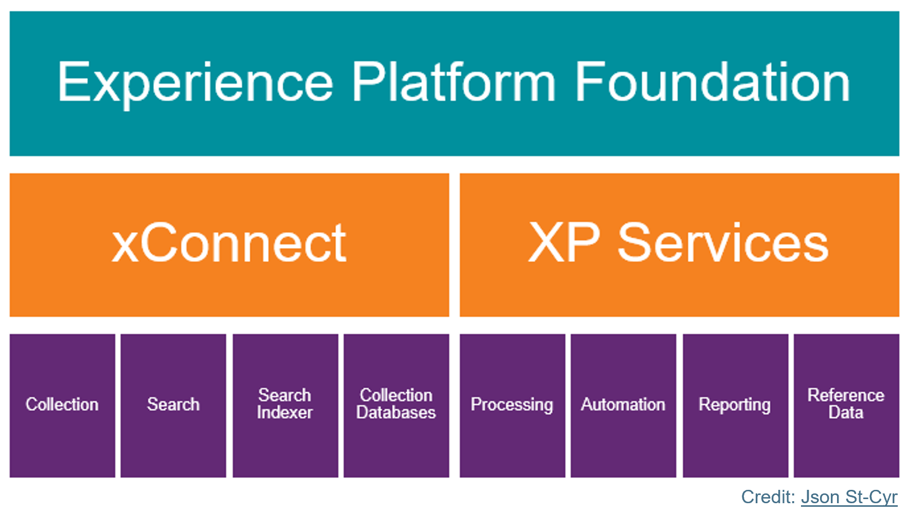
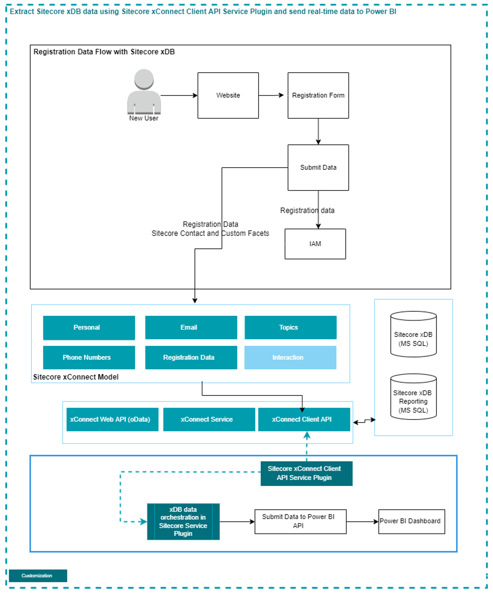

# PowerBIPushIntegration

# Capture Sitecore xConnect Data at runtime
In [Sitecore Experience Platform](https://doc.sitecore.com/xp/en/users/102/sitecore-experience-platform/index-en.html), we have [Sitecore xConnect Services](https://doc.sitecore.com/xp/en/developers/102/sitecore-experience-platform/xconnect-and-the-xdb.html) which can be used to capture Sitecore Analytics data, and later extracted data can be used to create extended analytics Reporting Views for Business User’s with the help of External Integrations e.g., Microsoft Power BI.

### Sitecore xConnect: 
-  xConnect is the service layer/api end point

-  xConnect responsible for all interactions related to analytics and marketing data in Sitecore echo system

-  Any external device/system needs to connect with xConnect API to get access of User’s profile/interaction data

-  No other system has direct access to the xDB Collection database or the xDB index

-  xConnect consists of the following components:
    -   Collection service
    -   Search service
    -   Search Indexer
    -   Collection databases

The [Sitecore xConnect](https://doc.sitecore.com/xp/en/developers/102/platform-administration-and-architecture/xconnect-collection-service.html) provides the [Service Plugin](https://doc.sitecore.com/xp/en/developers/102/sitecore-experience-platform/service-plugins.html) capability to capture the following xConnect events:

- Batch executed

- Batch executing

- Batch execution failed

- Operation added

- Operation completed

- Operation executing

In the above flow whenever any interaction happening with Sitecore Contact then with the help of [Sitecore xConnect Service Plugin](https://doc.sitecore.com/xp/en/developers/102/sitecore-experience-platform/service-plugins.html) we can capture the [Sitecore Contact](https://doc.sitecore.com/xp/en/developers/102/sitecore-experience-platform/tracking-contacts.html) details at real-time and stored/send to any data source.

# Module Details:
The [Sitecore xConnect Service Plugin](https://doc.sitecore.com/xp/en/developers/102/sitecore-experience-platform/service-plugins.html) module using:
1.	Sitecore xConnect/ Sitecore.XConnect.Collection.Model/ Sitecore.XConnect.Core/ Sitecore.XConnect.ServicePlugins Binaries.
2.	[Power BI](https://learn.microsoft.com/en-us/power-query/) Integration – in this we have to perform following steps:
  - Creation of [Power BI Schema](/Sitecore.XConnect.ServicePlugins.Tracker/BowerBIDataSet.json)
  - [Power BI API](https://learn.microsoft.com/en-us/rest/api/power-bi/push-datasets/datasets-post-dataset) to push Sitecore xConnect Data to [Power BI](/Sitecore.XConnect.ServicePlugins.Tracker/Service/DataExportService.cs)

<strong>With the help of above changes you will be able to push Sitecore xConnect Data at real-time to any datasource (e.g. Power BI).</strong>

# How to use Sitecore xConnect Service Plugin Codebase:
1.	To use this code base, first you have to build the solution.
2.	Deploy binaries (Sitecore.XConnect.ServicePlugins.InteractionsTracker.dll) of [Sitecore.XConnect.ServicePlugins.InteractionsTrackerCreate](/Sitecore.XConnect.ServicePlugins.Tracker/) solution into Sitecore xConnet Role
3.	Deploy the required [Configuration details](/Sitecore.PowerBIIntegration/App_Config/Include/Sitecore.PowerBIIntegration/Sitecore.PowerBIIntegration.config) from `Sitecore.PowerBIIntegration solution` into `Sitecore xConnect Role` to connect with Power BI for data sync
4.	Deploy the [Sitecore xConnect ServicePlugins details](/Sitecore.XConnect.ServicePlugins.Tracker/App_Data/Config/sitecore/Collection/sc.Custom.Service.Plugins.xml) into `Sitecore xConnect Role`

# Updates: Changes done for Sitecore 10.x
* [Sitecore XP 10.1.0](https://dev.sitecore.net/Downloads/Sitecore_Experience_Platform/101/Sitecore_Experience_Platform_101.aspx) ready
* Use of [PackageReference](https://docs.microsoft.com/en-us/nuget/consume-packages/package-references-in-project-files) in solution
* Use of [Microsoft.Build.CentralPackageVersions](https://github.com/microsoft/MSBuildSdks/tree/main/src/CentralPackageVersions)
* Added the support for [Contact Tracking](/Sitecore.XConnect.ServicePlugins.Tracker/Plugins/ContactTrackerPlugin.cs) and capture [Sitecore OOTB Contact Facets and Sitecore Custom Contact Facets](/Sitecore.XConnect.ServicePlugins.Tracker/Service/DataExportService.cs)

# Credit:
A big thanks to Brimit Team Members, [Alexei Vershalovich](https://www.brimit.com/blog/author?authors=Alexei%20Vershalovich) and [Artsem Prashkovich](https://www.brimit.com/blog/author?authors=Artsem%20Prashkovich) for sharing useful information related to  Sitecore xConnect Service Plugin at [Real-Time Power BI Dashboard from Sitecore xDB](https://www.brimit.com/blog/real-time-power-bi-dashboard-sitecore-xdb), [Sitecore xConnect How-to: Service Plugin Implementation](https://www.brimit.com/blog/sitecore-xconnect-service-plugin-implementation) and [PowerBIPushIntegration GitHub Repo](https://github.com/avershalovich/PowerBIPushIntegration).